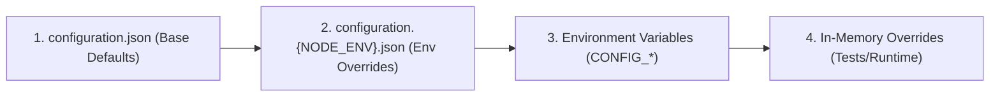

# @storesprite/app-config

`@storesprite/app-config` provides a layered, environment-aware configuration architecture for Node.js services (inspired by .NET's `Microsoft.Extensions.Configuration`).

It unifies application settings across multiple sources (JSON files, environment variables, in-memory test overrides) into a single, strongly-typed, and easily testable `IConfiguration` interface.

---

## Key Features

* **Multi-Source Layering**: Combines base JSON configuration, environment-specific overrides (`dev`, `test`, `prod`), environment variables, and in-memory test collections.
* **Precedence Resolution**: Predictable last-source-wins override model.
* **Flexible Key Syntax**: Supports both colon (`redis:connection:host`) and dot (`redis.connection.host`) notation.
* **Strongly-Typed Sections**: Extract typed interface sections with `getSection<T>("redis")`.
* **Environment Variable Mapping**: Automatically maps double-underscore environment variables to nested object keys (e.g. `CONFIG_REDIS__PORT=6379` $\rightarrow$ `redis.port = 6379`).
* **Dependency Injection Ready**: Seamless integration with InversifyJS.
* **Test Isolation**: Easily supply in-memory overrides for unit tests without polluting environment variables or files.

---

## Configuration Precedence Order

When using `ConfigurationBuilder.createDefault()`, sources are loaded in the following order:



Later sources overwrite values from earlier sources. Deep objects are merged cleanly rather than completely replaced.

---

## Directory Conventions

In consuming services (such as `storesprite-be` or `stocksprite`), create a `configuration/` folder in the project root:

```text
my-service/
├── configuration/
│   ├── configuration.json         # Base defaults for all environments
│   ├── configuration.dev.json     # Development overrides (NODE_ENV=dev)
│   ├── configuration.test.json    # Test mocks / queues (NODE_ENV=test)
│   └── configuration.prod.json    # Production overrides (NODE_ENV=production)
└── src/
    └── config/
        └── configuration.ts       # Builds and exports IConfiguration instance
```

---

## Usage Guide

### 1. Basic Initialization

Create an application configuration instance using the default builder:

```typescript
import { ConfigurationBuilder, type IConfiguration } from "@storesprite/app-config";

// Loads configuration/configuration.json, configuration.{NODE_ENV}.json, and CONFIG_* env vars
export const configuration: IConfiguration = ConfigurationBuilder.createDefault().build();
```

---

### 2. Reading Configuration Values

`IConfiguration` provides simple, type-safe accessor methods:

```typescript
import { configuration } from "./config/configuration.js";

// 1. Primitive access (dot or colon notation)
const host = configuration.get<string>("redis:connection:host");
const port = configuration.get<number>("redis.connection.port");

// 2. Default fallback if key is undefined
const timeout = configuration.getOrDefault<number>("http:timeoutMs", 5000);

// 3. Check key existence
if (configuration.has("unas:apiKey")) {
    // ...
}

// 4. Extract strongly-typed object sections
interface IRedisSection {
    connection: {
        host: string;
        port: number;
    };
    timeout?: number;
}

const redisConfig = configuration.getSection<IRedisSection>("redis");
console.log(redisConfig?.connection.host);
```

---

### 3. Dependency Injection with InversifyJS

Register `IConfiguration` in your Inversify container:

```typescript
import { Container } from "inversify";
import { ConfigurationBuilder, type IConfiguration } from "@storesprite/app-config";

export const TYPES = {
    IConfiguration: Symbol.for("IConfiguration"),
};

export const container = new Container();
const config = ConfigurationBuilder.createDefault().build();

container.bind<IConfiguration>(TYPES.IConfiguration).toConstantValue(config);
```

Inject it into services:

```typescript
import { injectable, inject } from "inversify";
import type { IConfiguration } from "@storesprite/app-config";
import { TYPES } from "./types.js";

@injectable()
export class WebshopService {
    constructor(
        @inject(TYPES.IConfiguration) private _config: IConfiguration
    ) {}

    public sync(): void {
        const unasBaseUrl = this._config.getOrDefault<string>("unas:baseUrl", "https://api.unas.eu");
        // ...
    }
}
```

---

### 4. Environment Variables Override

Environment variables prefixed with `CONFIG_` automatically map nested JSON paths using double underscores (`__`):

| Environment Variable | JSON / Key Equivalent |
| :--- | :--- |
| `CONFIG_REDIS__CONNECTION__HOST=my-redis-host` | `redis:connection:host` |
| `CONFIG_REDIS__CONNECTION__PORT=6379` | `redis:connection:port` |
| `CONFIG_SERVER__PORT=8080` | `server:port` |

Values that are valid JSON strings (numbers, booleans, arrays, nested JSON) are automatically parsed.

---

### 5. Custom Builder Configuration

You can customize the base path, environment name, or register custom sources:

```typescript
import { ConfigurationBuilder } from "@storesprite/app-config";

const config = new ConfigurationBuilder({
    basePath: "/custom/app/root",
    environment: "staging",
    throwOnMissingFile: false,
})
    .addJsonFile("./config/shared.json", true)
    .addJsonFile("./config/secrets.json", true)
    .addEnvironmentVariables("MYAPP_")
    .addInMemoryCollection({ runtimeFlag: true })
    .build();
```

---

### 6. Testing & In-Memory Overrides

For isolated unit tests, construct a test configuration in-memory without needing real files or modifying `process.env`:

```typescript
import { describe, it, expect, beforeEach } from "vitest";
import { Container } from "inversify";
import { ConfigurationBuilder, type IConfiguration } from "@storesprite/app-config";

describe("WebshopService Unit Tests", () => {
    let container: Container;

    beforeEach(() => {
        container = new Container();

        // Create test-specific configuration
        const testConfig: IConfiguration = new ConfigurationBuilder()
            .addInMemoryCollection({
                redis: { connection: { host: "mock-redis", port: 6379 } },
                unas: { mockResponses: true },
            })
            .build();

        container.bind<IConfiguration>("IConfiguration").toConstantValue(testConfig);
    });

    it("uses test configuration values", () => {
        const config = container.get<IConfiguration>("IConfiguration");
        expect(config.get<string>("redis:connection:host")).toBe("mock-redis");
    });
});
```
